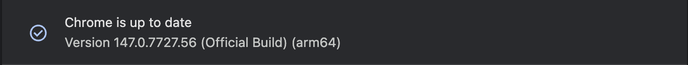

# Introduction

Hola, como estas?

My name is Jose Martinez and I am a humble mexican farmer. However don't let that fool you. I am the type of person who knows a guy who knows a guy who knows a guy who can help you manage your armed forces. Shall we draft an arrangement for you to engage my services?

# Functionality

Reads the city guard unit summary from a Wildungs game page and POSTs it
to a Supabase table or download as json.

# Status

Extension currently works and wraps units correctly

# Compatibility

For the moment compatibility is confirmed only for the below version of Chrome browser.

# Installation

Download deploy artifact, unpack and load as extension in chrome developer mode
